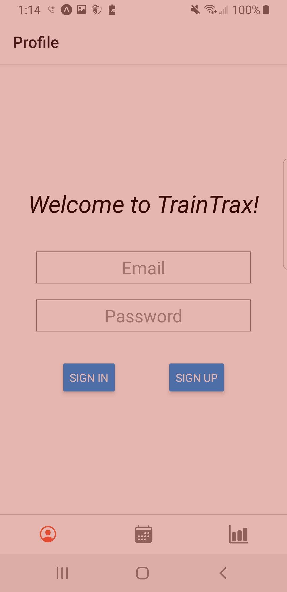
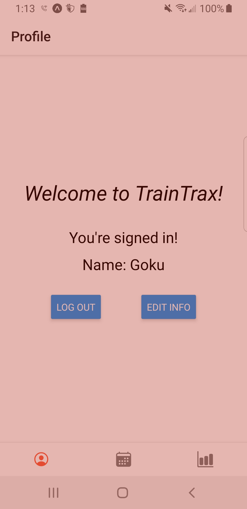

# TrainTrax

- [Summary](#summary)  
- [Gallery](#gallery)  
- [Features](#features)  
  - [Authentication](#authentication)  
  - [Update Profile Info](#update-profile-info)  
  - [View Workouts in Calendar](#view-workouts-in-calendar)  
  - [Workout (Add, View, Edit, Delete)](#workout-(add,-view,-edit,-delete))  
- [Issues](#issues)  
- [Technologies](#technologies)  
- [Limitations](#limitations)  
- [React Navigation & Components](#react-navigation-&-components)  
- [Schemas](#schemas)  

---
---
## Summary
This mobile app allows users to track their workouts and view stats per exercise. Users are able to navigate to a calendar screen, choose a date, and either add a workout or edit an existing one. They can aslo navigate to the stats screen, choose an exercise, and view its stats based on a user-provided date range.

---
---
## Gallery

#### **Authentication Screen**


#### **Profile Screen**


#### **Calendar Screen**
***coming soon***

#### **Workout Screen**
***coming soon***

---
---
## Features

---
### **Authentication**  

###### [BACK TO TOP](#traintrax)

**How to get to the [authetication screen](#authetication-screen)**  
- When the user opens the app and is ***not*** signed in, they are directed to the `authentication screen`.
- When the user logs out, they are redirected to the `authentication screen`.

**Relevant components to this feature**
- `text input` for email address
- `text input` for password
- `button` to sign-in
- `button` to sign-up

**User Actions**

- **User `signs up` with an *invalid* or *existing* `email address`**  
  - Currently nothing happens. See [issues](#issues).

- **User `signs in` with an *invalid* `email address` and/or and *invalid* `password`**
  - Currently nothing happens. See [issues](#issues).

- **User *successfully* `signs up` or *successfully* `signs in`**
  - The user is signed in, the firestore's `users` collection is updated with the new user, and the user is directed to the [profile screen](#profile-screen) where they'll see an option to `log out`.

- **User selects `log out`**
  - User is logged out and directed to the `authentication screen`.

---
### **Update Profile Info** 

###### [BACK TO TOP](#traintrax)

**How to get to the [profile screen](#profile-screen)**

- When the user signs in, they are directed to the `profile screen`.
- If the user is already signed in upon opening the app, they will automatically be directed to the `profile screen`.
- They can also navigate to the `profile screen` by selecting the bottom left tab.

**Relevant components to this feature**
- Here they'll see their name (default is *anonymous*) and options to `logout` or `edit info`.

**User Actions**

- **User selects `edit info`**
  - The user's name changes into a `text input`, pre-filled with the user's current name.
  - The `edit info` button changes to a `save changes` button.

- **User selects `save changes`**
  - If the user's new name is different from the old name and is at least one character long, the firestore is updated with the new name.
  - The `text input` changes back to regular text, displaying the new name if it's valid, or the old name otherwise.
  - The `save changes` button changes to a `edit info` button.

---
### **View Workouts in Calendar**

###### [BACK TO TOP](#traintrax)

**How to get to the `calendar screen`**
- Select the middle tab at the bottom of the screen.

**Relevant components to this feature**
- Upon the initial visit of the session, the current week will display.
- The screen title is updated to show the first day of the week (sunday).
- Below the title are three buttons for navigating the calendar.
- Each day will display it's date, a workout title if a workout exists, or a `plus` sign if a workout doesn't exist. Workouts with the default title *untitled* will only display if there is at least one exercise.

**User Actions**  

- **User selects the left arrow button (`<`)**
  - The previous week's workouts are loaded*.

- **User selects the right arrow button (`>`)**
  - The next week's workouts are loaded*.

- **User selects the `today` button**
  - The current week's workouts are loaded*.

*For faster loading, before querying the firestore for workout info, the cache is checked to see if the workout has already been loaded during this session. The firestore is queried for the workout info only if the cache doesn't have it. The info is stored in the cache after receiving it from the firestore.

---
### **Workout (Add, View, Edit, Delete)**  

###### [BACK TO TOP](#traintrax)

**How to get to the `workout screen`**
- The user must first [navigate to the `calendar screen`](#view-workouts-in-calendar).
- Selecting a day that previews a workout title will display that workouts info.
- Selecting a day that shows a `plus` sign will display an empty workout.

**Relevant components to this feature**


---
---
## Issues  

###### [BACK TO TOP](#traintrax)

  - [ ] **Alert user of authentication issues**
    - When users attempt to `sign-up` with an ***invalid***  or ***existing*** `email address` or attempt to `sign-in` with an ***invalid*** `email address` or `password`, nothing happens; There is no indication that something went wrong. They should be alerted about the issue. 
  - [ ] **Trim email and password when autheticating**
    - When users use autocomplete to enter their `email` and `password`, a trailing space is inserted. Trim the `email` and `password` of surrounding white space before authenticating the user.
  - [ ] **Calendar is *not* immediately loading upon initial visit**
    - Upon the first visit to the `calendar screen`, each day displayed ***loading*** and the screen title displayed the ***last*** day of the week (saturday) when it should have displayed the ***first*** day of the week (sunday). It did not correct itself until I tapped the `today` button. I'm unsure if tapping something else would have triggered it to correct, but it's an issue nonetheless. I logged out and logged back in

---
---
## Technologies

###### [BACK TO TOP](#traintrax)

- Expo for a fast React Native build
- Firebase for user authentication and storage

---
---

## Limitations

###### [BACK TO TOP](#traintrax)

- Only one workout is allowed per day
- It is assumed that exercises involve lifting weight (bodyweight counts)

---
---
## React Navigation & Components

###### [BACK TO TOP](#traintrax)

```
App Tabs
    Profile Tab
        Profile Stack
            Profile Screen
                Loading Component
                Auth Component --> Profile Component
                Profile Component
    Calendar Tab
        Calendar Stack
            Calendar Screen
                DayRow Component
                    Day Component --> Workout Screen
            Workout Screen --> Calendar Screen
                Exercise Component
                Set Component
    Stats Tab
        Stats Stack
            Stats Screen
```

---
---
## Schemas

###### [BACK TO TOP](#traintrax)

### User
```
{
  name: STRING,
  workouts: collection
}
```
### Workout
```
{
  date: STRING, //unique; Www Mmm DD YYY (ex. Mon Feb 22 2021)
  title: STRING,
  bodyweight: INTEGER,
  exercises: [exercise schema]
}
```
### Exercise
```
{
  name: STRING,
  sets: [set schema]
}
```
### Set
```
{
  goal: INTEGER,
  reps: INTEGER,
  weight: INTEGER,
}
```
---
---